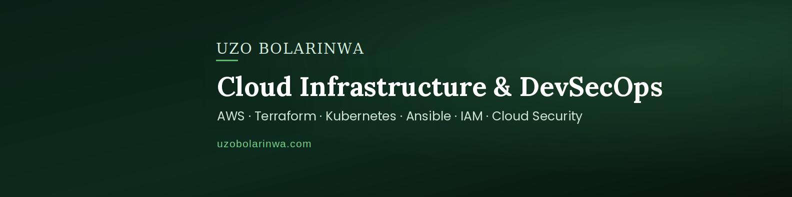

  

<h2 align="center">Cloud Infrastructure &amp; DevSecOps Engineer</h2>

  <strong>AWS | Terraform | Kubernetes | Ansible | CI/CD | IAM | Cloud Security</strong>

I build and validate secure AWS infrastructure and delivery platforms using Terraform, Ansible, containers, Kubernetes, and CI/CD. 
My production background is in Linux systems administration and automation; my current independent engineering work extends that foundation into AWS infrastructure, GitOps, cloud identity, and DevSecOps security controls.

  <strong>Production foundation:</strong>
  2,000+ Linux-based point-of-sale systems | 1,200+ regression tests | 50+ releases

  <a href="https://uzobolarinwa.com">Portfolio</a> |
  <a href="https://www.linkedin.com/in/uzobolarinwa">LinkedIn</a>

---

<h2 align="center">Selected Engineering Work</h2>

### [Private Multi-AZ AWS Infrastructure Automation](https://github.com/uzobola/aws-private-web-infrastructure-automation)

**Terraform | Ansible | EC2 | ALB | SSM | IAM | CloudWatch**

Engineered a two-AZ AWS web platform with segmented public/private networking, private EC2 instances, ALB, NAT, S3, VPC endpoints, VPC Flow Logs, CloudWatch logging, and hardened security groups.

Removed public EC2 IPs and inbound SSH, used AWS Systems Manager for administration and Ansible transport, separated execution and workload identities, validated least privilege with denied-operation tests, and confirmed Ansible idempotence with a repeat run at `changed=0`.

---

### [Secure AWS ECS Fargate CI/CD Platform](https://github.com/uzobola/ecs-fargate-cicd-pipeline)

**Terraform | ECS/Fargate | Jenkins | GitHub Actions | Docker | ECR | Checkov | Trivy**

Built a multi-AZ AWS container platform with private ECS/Fargate services behind an ALB, encrypted remote Terraform state, Amazon ECR, CloudWatch logging, scoped IAM roles, and target-tracking autoscaling.

Implemented secure Jenkins and GitHub Actions delivery paths with Checkov validation, Trivy HIGH/CRITICAL gates, immutable ECR publishing, OIDC-based temporary AWS credentials, deployment validation, and controlled-load testing that scaled services from one to two running tasks.

---

### [AWS EKS Kubernetes CI/CD & GitOps Platform](https://github.com/uzobola/eks-kubernetes-cicd-platform)

**Terraform | EKS | Kubernetes | Jenkins | Helm | GitHub Actions | Argo CD**

Provisioned Amazon EKS with Terraform and delivered containerized workloads through Jenkins, Docker, Amazon ECR, Helm, and Kubernetes deployment workflows with Checkov IaC validation and Trivy container-image scanning.

Implemented GitHub Actions OIDC federation and an Argo CD GitOps delivery path for immutable releases; validated horizontal pod scaling from one to three replicas and managed-node-group expansion from one to four nodes.

---

<h2 align="center">Security Engineering</h2>

### [AWS Non-Human Identity Governance Engine](https://github.com/uzobola/aws-nhi-governance-engine)

**Python | AWS IAM | Terraform | GitHub Actions | OIDC**

Developed a Python-based AWS identity-governance engine that evaluates IAM roles, users, access keys, secrets, and trust policies through **11 detectors** aligned to the **OWASP Non-Human Identity Top 10** and **NIST SP 800-53**.

Used GitHub Actions OIDC to eliminate stored AWS credentials from CI workflows, gated CI on open HIGH/CRITICAL findings, and generated audit-ready JSON/Markdown evidence supported by **37 unit tests**.

---

### [Zero-Trust Serverless Notes API](https://github.com/uzobola/zero-trust-serverless-cdk)

**AWS CDK (Python) | Cognito | API Gateway | Lambda | DynamoDB | KMS**

Built a serverless AWS API using Cognito JWT authentication, API Gateway authorization, route-scoped Lambda execution roles, and DynamoDB access bound to the authenticated principal.

Prevented BOLA/IDOR-style horizontal privilege escalation through authorization design and negative testing; added customer-managed KMS encryption, point-in-time recovery, structured logging, and X-Ray tracing.

---

## Technical Focus

- **Cloud Infrastructure:** AWS, Terraform, Ansible, VPC, EC2, ALB, ECS/Fargate, EKS, S3, Systems Manager
- **Containers & Platform:** Docker, Kubernetes, Helm, Argo CD, GitOps
- **CI/CD & Security:** Jenkins, GitHub Actions, OIDC/STS, Checkov, Trivy, immutable artifacts, deployment validation
- **Cloud Security & Identity:** AWS IAM, least privilege, workload identity, RBAC, Zero Trust
- **Systems & Observability:** Linux, Python, Bash, CloudWatch, Prometheus, Grafana

---

## Certifications

- [AWS Certified Security – Specialty](https://www.credly.com/badges/bf44899b-4328-459e-abd2-5eefb5d981e6/public_url)
- [AWS Certified Solutions Architect – Associate](https://www.credly.com/badges/92dc96b5-7732-4b7a-873a-771a9ed3a0ff/public_url)
- [Red Hat Certified Engineer (RHCE)](https://www.credly.com/badges/df77ef72-93d5-46b3-9712-989b3bc5a814/public_url)
- Red Hat Certified System Administrator (RHCSA)
- [CompTIA Security+](https://www.credly.com/badges/e6d893b2-eded-4f6e-a83f-1994a209dafc/public_url)

---

## Contact

**Portfolio:** https://uzobolarinwa.com  
**LinkedIn:** https://www.linkedin.com/in/uzobolarinwa
